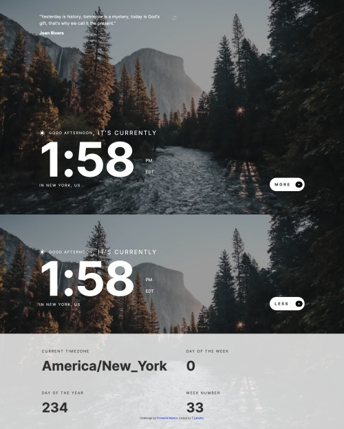
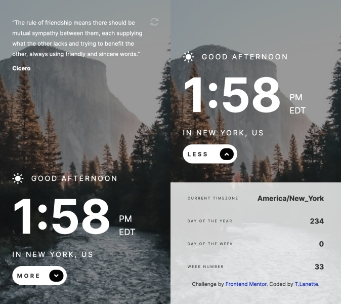

# Frontend Mentor - Clock app solution

This is a solution to the [Clock app challenge on Frontend Mentor](https://www.frontendmentor.io/challenges/clock-app-LMFaxFwrM). Frontend Mentor challenges help you improve your coding skills by building realistic projects. 

## Table of contents

- [Overview](#overview)
  - [The challenge](#the-challenge)
  - [Screenshot](#screenshot)
  - [Links](#links)
- [My process](#my-process)
  - [Built with](#built-with)
  - [What I learned](#what-i-learned)
  - [Continued development](#continued-development)
  - [Useful resources](#useful-resources)
- [Author](#author)
- [Acknowledgments](#acknowledgments)

## Overview

### The challenge

Users should be able to:

- View the optimal layout for the site depending on their device's screen size
- See hover states for all interactive elements on the page
- View the current time and location information based on their IP address
- View additional information about the date and time in the expanded state
- Be shown the correct greeting and background image based on the time of day they're visiting the site
- Generate random programming quotes by clicking the refresh icon near the quote

### Screenshot
#### Desktop Clock App

***

#### Tablet Clock App

***

#### Mobile Clock App

***

I have included two screen shots of four devices: 
* Nexus 5 (360x640)
* iPad (768x1024)
* MacBook Air (1440x900)

I used an awesome open-source devtool app called [Responsively](https://opencollective.com/responsively). It allowed me to see the calculator on different sized devices live while I was editing. You can inspect the code and take screen shots.  I also used the [Photoscape app](http://www.photoscape.org/ps/main/index.php). It's a free photo editing app (you can pay for extras). I was able to combine screenshots of each area of my Clock App and resize the final photo. 
### Links

- Solution URL: [Add solution URL here](https://your-solution-url.com)
- Live Site URL: Here's my finished app - [Clock App TLP](http://clock-app-tlp.vercel.app/)

## My process

### Built with

- Semantic HTML5 markup
- CSS custom properties
- Flexbox
- CSS Grid
- Mobile-first workflow
- [Sass](https://sass-lang.com/) - I love using SASS! 


### What I learned

I had a difficult time with this project because I kept over-thinking the positioning of the elements. I restarted the styling of this app at least 2 times. Then I saw a coding tweet that made everthing click -- It said that less CSS is sometimes better to use for your styling. I decided to follow one coder's example which had fewer lines of CSS than my original style sheet. 

One new style I learn about is the transform-function **translate3d()**. This function repositions an element in 3D space. It was used to change the position of the footer element when the button was clicked. 


To see how you can add code snippets, see below:

```css
.transform {
    transform: translate3d(0, -25.6rem, 0);

    @include md-breakpoint {
        transform: translate3d(0, -44rem, 0);
    }

    @include xl-breakpoint {
        transform: translate3d(0, -40rem, 0);
    }
}
```

If you want more help with writing markdown, we'd recommend checking out [The Markdown Guide](https://www.markdownguide.org/) to learn more.

**Note: Delete this note and the content within this section and replace with your own learnings.**

### Continued development

Use this section to outline areas that you want to continue focusing on in future projects. These could be concepts you're still not completely comfortable with or techniques you found useful that you want to refine and perfect.

**Note: Delete this note and the content within this section and replace with your own plans for continued development.**

### Useful resources

- [Example resource 1](https://www.example.com) - This helped me for XYZ reason. I really liked this pattern and will use it going forward.
- [Example resource 2](https://www.example.com) - This is an amazing article which helped me finally understand XYZ. I'd recommend it to anyone still learning this concept.

**Note: Delete this note and replace the list above with resources that helped you during the challenge. These could come in handy for anyone viewing your solution or for yourself when you look back on this project in the future.**

## Author

- Website - [Add your name here](https://www.your-site.com)
- Frontend Mentor - [@yourusername](https://www.frontendmentor.io/profile/yourusername)
- Twitter - [@yourusername](https://www.twitter.com/yourusername)

**Note: Delete this note and add/remove/edit lines above based on what links you'd like to share.**

## Acknowledgments

This is where you can give a hat tip to anyone who helped you out on this project. Perhaps you worked in a team or got some inspiration from someone else's solution. This is the perfect place to give them some credit.

**Note: Delete this note and edit this section's content as necessary. If you completed this challenge by yourself, feel free to delete this section entirely.**
